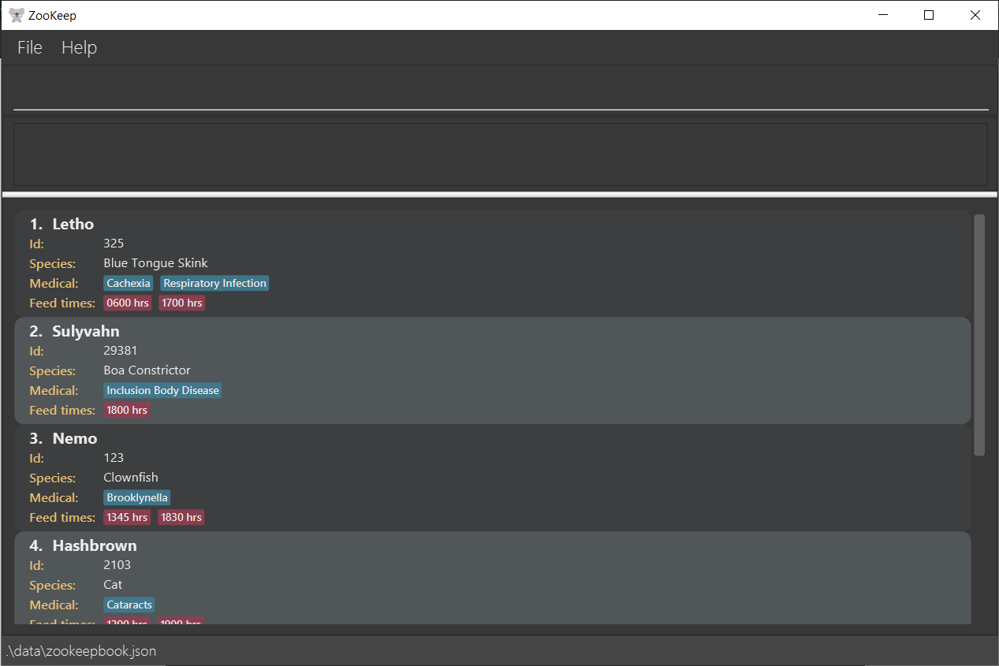

1. Table of Contents
{:toc}

## Introduction
ZooKeep is a desktop app for managing animals under a zookeeper’s care, optimized for use via a Command Line Interface (CLI) while still having the benefits of a Graphical User Interface (GUI). If you can type fast, ZooKeep can get your management tasks done faster than traditional GUI apps.

## Quick start

1. Ensure you have Java `11` or above installed in your Computer.

1. Download the latest `ZooKeep.jar` from [here](https://github.com/AY2021S1-CS2103T-W15-4/tp/releases).

1. Copy `ZooKeep.jar` to the folder you want to use as the _home folder_ for the app.

1. Double-click the file to start the app. The GUI similar to the below should appear in a few seconds. Note how the app contains some sample data. 
   

1. Type the command in the command box and press Enter to execute it, e.g. typing **`help`** and pressing Enter will open the help window.
     Here are some example commands you can try:

   * **`list`** : Lists all animals.
   * **`exit`** : Exits the app.

1. Refer to the [Features](#features) below for details of each command.

## Features

**:information_source: Notes about the command format:** 

* Words in `UPPER_CASE` are the parameters to be supplied by the user. 
  e.g. in `add n/NAME`, `NAME` is a parameter which can be used as `add n/Hershey`.

* Items in square brackets are optional. 
  e.g `n/NAME [t/TAG]` can be used as `n/Hershey t/bird` or as `n/Hershey`.

* Items with `…`​ after them can be used multiple times including zero times. 
  e.g. `[t/TAG]…​` can be used as ` ` (i.e. 0 times), `t/bird`, `t/bird t/timid` etc.

* Parameters can be in any order. 
  e.g. if the command specifies `n/NAME s/SPECIES i/ID`, `n/NAME i/ID s/SPECIES` is also acceptable.

#### Viewing help : `help`

Shows a message explaining how to access the help page.

Format: `help`

---

#### Adding an animal: `add`

Adds an animal under the care of the user.

Format: `add n/NAME s/SPECIES i/ID [t/TAG]…​`

:bulb: **Tip:**
An animal can have any number of tags (including 0).

Examples:
* `add n/Hershey s/Rufous Hummingbird i/0193`
* `add n/Lonesome George s/Galapagos Tortoise i/0007 t/herbivore`

---

#### Listing all animals : `list`

Lists all animals under the care of the user.

Format: `list`

---

#### Deleting an animal: `delete`

Deletes the specified animal from the app.

Format: `delete i/ID`

* Deletes the animal at the specified `ID`.
* ID refers to the id number shown in the displayed animal list.

Examples:
* `delete i/0193` deletes the individual animal with id 0193.

---

#### Clearing all entries : `clear`

Clears all entries from the app.

Format: `clear`

---

#### Exiting the program : `exit`

Exits the program.

Format: `exit`

---

#### Saving the data

Animal data is saved in the hard disk automatically after any command that changes the data. There is no need to save manually.

## FAQ

**Q**: How do I transfer my data to another Computer? 
**A**: Install the app in the other computer and overwrite the empty data file it creates with the file that contains the data of your previous ZooKeep home folder.

## Command summary

Action | Format, Examples
--------|------------------
**Add** | `add n/NAME s/SPECIES i/ID [t/TAG]…​`   e.g. `add n/Lonesome George s/Galapagos Tortoise i/0007 t/herbivore`
**Clear** | `clear`
**Delete** | `delete i/ID`  e.g. `delete i/0193`
**Exit** | `exit`
**Help** | `help`
**List** | `list`
